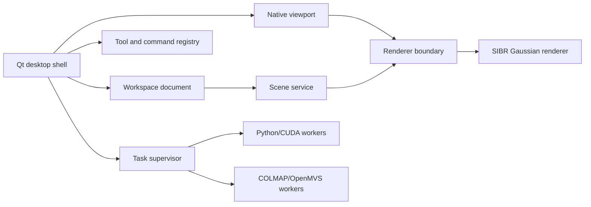

# Native Desktop Migration

## Decision

Gaussian Scene Workbench 0.3 is being rebuilt as a native Windows desktop application. Qt 6/C++ owns the application shell, workspace state, docking UI, process lifecycle, and viewport. Existing Python/CUDA training code remains a compute backend and is launched as a supervised worker rather than through a local website.

The stable Electron 0.2.x implementation remains on `main` until the native branch reaches workflow parity. The native executable never embeds the legacy HTML UI.

## Product reference model

The workspace follows the mature desktop layout used by photogrammetry and radiance-field tools:

- Postshot: main tools, viewport tools, central viewport, scene tree, selected-node parameters, timeline, and processing progress.
- Agisoft Metashape: project-centric workspace, explicit processing jobs, persistent panes, and inspectable intermediate reconstruction stages.
- LichtFeld Studio: separate scene, selection, training, rendering, tool-registry, and plugin services around a native renderer.

Primary references:

- https://www.jawset.com/docs/d/Postshot%20User%20Guide/Interface
- https://github.com/MrNeRF/LichtFeld-Studio
- https://lichtfeld.io/

## Architecture

The first implementation intentionally keeps these boundaries small:

- `WorkspaceDocument` owns portable project metadata and asset references.
- `ProcessSupervisor` owns one external worker lifecycle and streams logs into the native task panel.
- `NativeViewport` owns OpenGL context, asynchronous point-scene upload, navigation, full-source selection projection, overlays, and interaction-mode state.
- `SceneEditModel` owns compact selection/deletion masks, original vertex identity, and bounded undo/redo history.
- `MainWindow` composes UI only; training and scene behavior move into dedicated managers as their state models mature.

The next internal services will follow the same proven separation visible in LichtFeld Studio without copying GPL implementation code: `SceneManager`, `TrainingStateMachine`, `ToolRegistry`, and a renderer frame-lifecycle service.

## Migration phases

### 0.3.0 native preview

- Buildable Qt 6 application and Windows CI artifact.
- Adaptive DPI/manual UI scale, dock layout persistence, and compact professional workspace.
- Project creation/open/save, dataset import, PLY metadata and point import, task logs, environment checks, and supervised 3DGS training launch.
- Native OpenGL point preview with deterministic sampling and explicit separation from future SIBR splat metrics.
- Full-source rectangle/lasso selection, visible-only depth filtering, original-index delete history, undo/redo, and native lossless cropped PLY export.

### 0.3.x renderer integration

- Introduce the renderer boundary and embed the bundled SIBR Gaussian renderer in the Qt-owned graphics context.
- Load scene data once and keep it in native/GPU memory.
- Report renderer frame time, presented FPS, GPU time, and Gaussian count separately. Never infer thousands of FPS by dividing a sub-millisecond UI paint duration.
- Add camera frustums, point/splat modes, brush/GPU ID selection, crop volumes, and additional export formats.

### 0.4 training and reconstruction parity

- Replace generic worker launch with typed jobs and a training state machine.
- Add conversion, COLMAP reconstruction, method profiles, checkpoint resume, metrics, and experiment comparison.
- Persist job manifests and recover interrupted jobs.

### 0.5 platform cleanup

- Remove Electron, HTML, CSS, JavaScript, Node, and local HTTP runtime code only after native parity tests pass.
- Ship a native installer with a selectable installation path and separate user data/cache locations.

## License rule

LichtFeld Studio is GPL-3.0-or-later. Reading its source to understand architecture and behavior does not change this repository's license. Copying, adapting, or linking GPL implementation code into the native application requires a compatible GPL release and an explicit repository licensing change. The current preview is an independent implementation.
